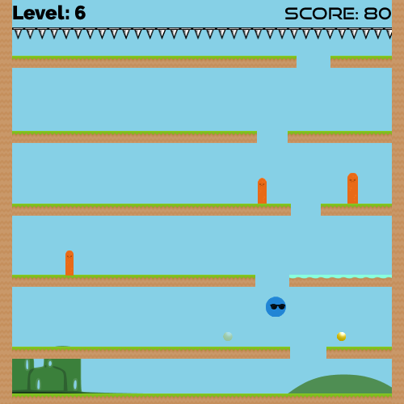

# The Falling of Momo

  

## Description

  The Falling of Momo is a Falldown-inspired, casual survival game. However, what makes the game unique is that players control Momo's movement using their forearm muscles. For a right-handed player, this means flexing your wrist inwards to move Momo left, and extending your wrist out to make Momo move right. Momo can also jump by quickly flexing both muscles in unison, a motion known as an "impulse".

  Momo was designed in partnership by:

  - [The Human Computer Interaction Lab, University of New Brunswick](http://hci.cs.unb.ca/)
  - [The Institute of Biomedical Engineering, University of New Brunswick](http://www.unb.ca/research/institutes/biomedical/)
  - [The Atlantic Clinic for Upper Limb Prosthetics](http://limbclinic.com/)

## Purpose

  The game was designed specifically to help individuals who are first learning to use a special type of robotic arm known as a myoelectric prosthesis. For people who don't have both of thier hands (whether since-birth, or as the result of an accident), this type of robotic arm can be a big help when performing common daily activities like cooking, cleaning, or getting dressed. However, To get the most out of their prosthesis, new users need to train their muscles quite a bit. Since playing Momo can build strenth and familiarity in the same muscles used for prostheis use, 

## Myo Armband

  The Falling of Momo makes use of the [Myo Armband by Thalmic Labs](https://www.myo.com/) to capture all muscles readings. If you think you might be interested in the game, but don't yet own a Myo Armband, the game can also be played with a standard keyboard.

## Research

  In addition to being a muscle training game for new prosthesis users, Momo is also a research tool. We've used the game to learn about the design of therapeutic games, as well as about more general aspects of muscle training. If you're interesteing in learning about the research we've done with Momo, check out the related publications below:

  - [Aaron Tabor, Alex Kienzle, Carly Smith, Alex Watson, Jason Wuertz, and David Hanna. *The Falling of Momo: A Myo-Electric Controlled Game to Support Research in Prosthesis Training.* In Proceedings of the 2016 Annual Symposium on Computer-Human Interaction in Play Companion Extended Abstracts (2016): 71-77.](https://dl.acm.org/citation.cfm?id=2971806)
  - [Aaron Tabor, Scott Bateman, Erik Scheme, David R Flatla, Kathrin Gerling. *Designing Game-Based Myoelectric Prosthesis Training.* In Proceedings of the ACM Conference on Human Factors in Computing Systems, May 2017, Denver, USA. p1352-1363.](https://dl.acm.org/citation.cfm?id=3025676)
  - Tabor, Aaron, Wendy Hill, Scott Bateman, and Erik Scheme. *Quantifying Muscle Control in Myoelectric Training Games.* In Proceedings of Myoelectric Control Symposium (MEC) 2017. Fredericton, New Brunswick.

 We thank both the National Science and Engineering Reserach Council (NSERC) and the New Brunswick Innovation Foundation (NBIF) for their financial support in our research.

## Contributors

  - Dr. Scott Bateman
  - Dr. Erik Scheme
  - Wendy Hill

  - Aaron Tabor
  - Alex Kienzle
  - Alex Watson
  - Carly Smith
  - David Hannah
  - Jason Wuertz

We also thank all of the anonymous experts and prosthesis users who participated in design sessions conducted throughout the development of the game.
